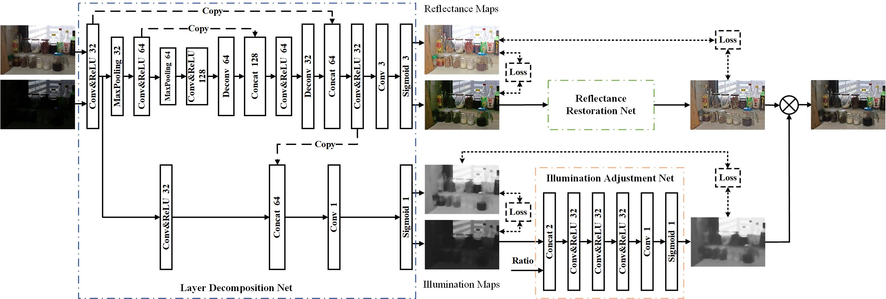
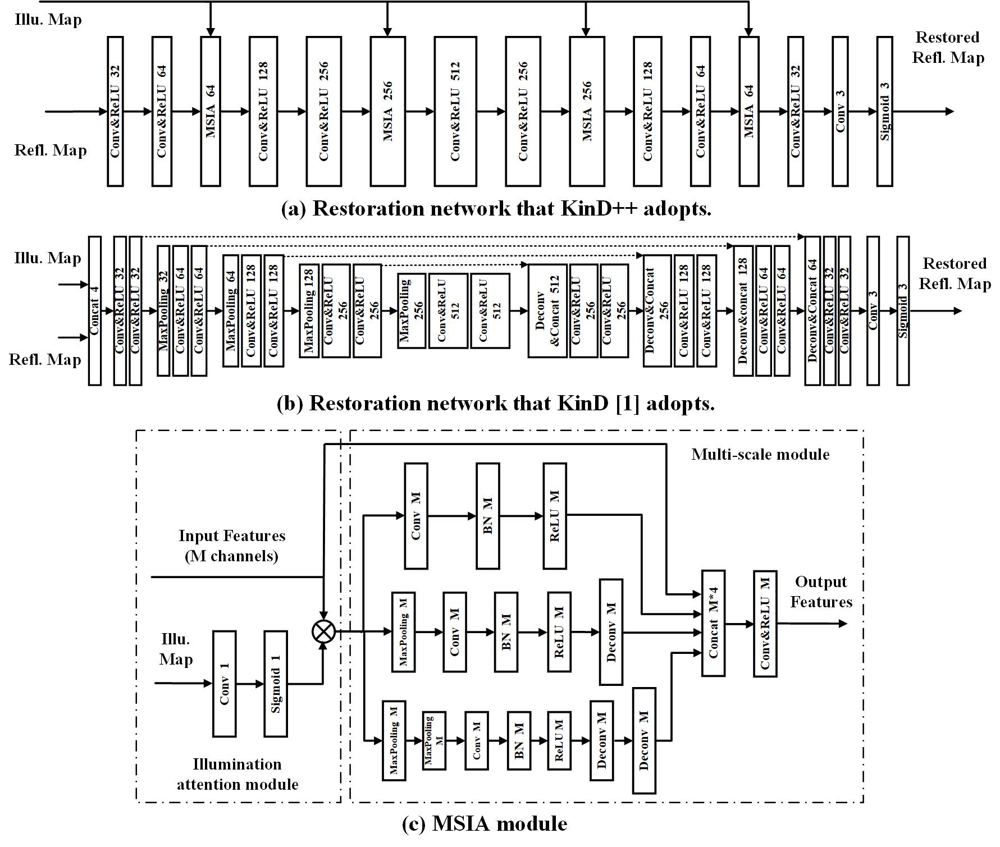
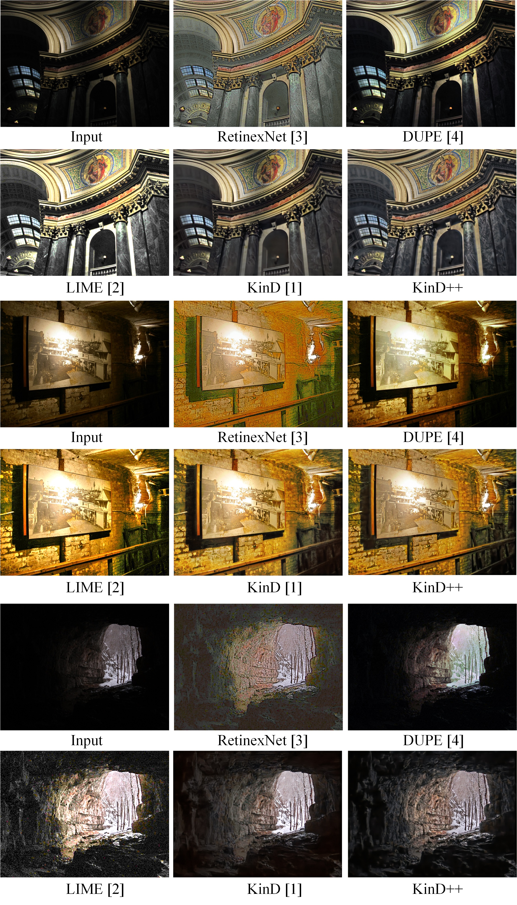

# KinD++
This is a Tensorflow implementation of KinD++. (For the [paper](https://link.springer.com/article/10.1007/s11263-020-01407-x): Beyond Brightening Low-light Images)

Zhang, Y., Guo, X., Ma, J. et al. Beyond Brightening Low-light Images. IJCV, (2021).

We propose a novel multi-scale illumination attention module (MSIA), which can alleviate visual defects (e.g. non-uniform spots and over-smoothing) left in [KinD](https://github.com/zhangyhuaee/KinD). 

The KinD net was proposed in the following [Paper](http://doi.acm.org/10.1145/3343031.3350926).

Kindling the Darkness: a Practical Low-light Image Enhancer. In ACM MM 2019<br>
Yonghua Zhang, Jiawan Zhang, Xiaojie Guo
****  

## The network architecture of KinD++: ##


----

## The reflectance restoration network and the MSIA module: ##
 

_____

### Visual comparison with state-of-the-art low-light image enhancement methods. ###


----

## Requirements ##
1. Python
2. Tensorflow >= 1.10.0
3. numpy, PIL

## Test ##
Please put test images into 'test_images' folder and download the pre-trained checkpoints from [google drive](https://drive.google.com/open?id=1RuW6fgkDEQ6v9GMlcWgtWiGglew6jplO) or [BaiduNetDisk](https://pan.baidu.com/s/1DY49dJSlue1PNWy05nZb5A), then just run
```shell
python evaluate.py
```
The test datasets (e.g. DICM, LIME, MEF and NPE) can be downloaded from [google drive](https://drive.google.com/open?id=12sUp8aOlNIB5h11lwsjs1Qm9sdH7v5p1). Our enhancement results of these datasets can be downloaded from [google drive](https://drive.google.com/open?id=1dBLdVV_-DEPyGOT5W8aLOetBqtEaMcl6). 

## Train ##
The original LOLdataset can be downloaded from [here](https://daooshee.github.io/BMVC2018website/). We rearrange the original LOLdataset and add several pairs all-zero images and 260 pairs synthetic images to improve the decomposition results and restoration results. The training dataset can be downloaded from [google drive](https://drive.google.com/open?id=1YztDWbK3MV5EroSpuWmYlPsmFcFGoLmq). For training, just run
```shell
python decomposition_net_train.py
python illumination_adjustment_net_train.py
python reflectance_restoration_net_train.py
```
You can also evaluate on the LOLdataset, just run
```shell
python evaluate_LOLdataset.py
```

## A survey of low-light image enhancement methods ##
### Traditional methods: ###
1. Single-scale Retinex (SSR) [5]
2. Multi-scale Retinex (MSR) [6]
3. Naturalness preserved enhancement (NPE) [7]
4. Fusion-based enhancing method (MEF) [8]
5. LIME [2]
6. SRIE [9]
7. Dong [10]
8. BIMEF [11]  
The __codes__ of above-mentioned methods can be found from [here](https://github.com/baidut/BIMEF/tree/master/lowlight).
9. CRM [12] ([code](https://github.com/zhangyhuaee/KinD_plus/tree/master/CRM))
### Deep learning methods: ###
10. RetinexNet [3] ([code](https://github.com/weichen582/RetinexNet))
11. GLADNet [13] ([code](https://github.com/weichen582/GLADNet))
12. DeepUPE [4] ([code](https://github.com/wangruixing/DeepUPE))
13. KinD [1] ([code](https://github.com/zhangyhuaee/KinD))


## NIQE code ##
Non-reference metric NIQE is adopted for quantitative comparison. The original code for computing NIQE is [here](https://github.com/csjunxu/Bovik_NIQE_SPL2013). To improve the robustness, we follow the author's code and retrain the model parameters by extending 100 high-resolution natural images from [PIRM dataset](https://pirm.github.io/).  Put the [original 125 images](http://live.ece.utexas.edu/research/quality/pristinedata.zip) and additional 100 images (dir: PIRM_dataset\Validation\Original) into one folder 'data', then run
```shell
[mu_prisparam cov_prisparam]  = estimatemodelparam('data',96,96,0,0,0.75);
```
After retrained, the file 'modelparameters_new.mat' will be generated. We use this model to evaluate all results.

## References ##
[1] Y. Zhang, J. Zhang, and X. Guo, “Kindling the darkness: A practical low-light image enhancer,” in ACM MM, 2019, pp. 1632–1640. 

[2] X. Guo, Y. Li, and H. Ling, “Lime: Low-light image enhancement via illumination map estimation,” IEEE TIP, vol. 26, no. 2, pp. 982–993, 2017.

[3] C. Wei, W. Wang, W. Yang, and J. Liu, “Deep retinex decomposition for low-light enhancement,” in BMVC, 2018.

[4] R. Wang, Q. Zhang, C.-W. Fu, X. Shen, W.-S. Zheng, and J. Jia, “Underexposed photo enhancement using deep illumination estimation,” in CVPR, 2019, pp. 6849–6857.

[5] D. J. Jobson, Z. Rahman, and G. A. Woodell, “Properties and performance of a center/surround retinex,” IEEE TIP, vol. 6, no. 3,
pp. 451–462, 1997.

[6] D. J. Jobson, Z. Rahman, and G. A. Woodell, “A multiscale retinex for bridging the gap between color images and the human observation of scenes,” IEEE TIP, vol. 6, no. 7, pp. 965–976, 2002.

[7] S. Wang, J. Zheng, H. Hu, and B. Li, “Naturalness preserved enhancement algorithm for non-uniform illumination images,”
IEEE TIP, vol. 22, no. 9, pp. 3538–3548, 2013.

[8] X. Fu, D. Zeng, H. Yue, Y. Liao, X. Ding, and J. Paisley, “A fusion-based enhancing method for weakly illuminated images,” Signal
Processing, vol. 129, pp. 82–96, 2016.

[9] X. Fu, D. Zeng, Y. Huang, X. Zhang, and X. Ding, “A weighted variational model for simultaneous reflectance and illumination
estimation,” in CVPR, 2016, pp. 2782–2790.

[10] X. Dong, Y. Pang, and J. Wen, “Fast efficient algorithm for enhancement of low lighting video,” in ICME, 2011, pp. 1–6.

[11] Z. Ying, L. Ge, and W. Gao, “A bio-inspired multi-exposure fusion framework for low-light image enhancement,” arXiv: 1711.00591,
2017.

[12] Z. Ying, L. Ge, Y. Ren, R. Wang, and W. Wang, “A new low-light image enhancement algorithm using camera response model,” in
ICCVW, 2018, pp. 3015–3022.

[13] W. Wang, W. Chen, W. Yang, and J. Liu, “Gladnet: Low-light enhancement network with global awareness,” in FG, 2018.

